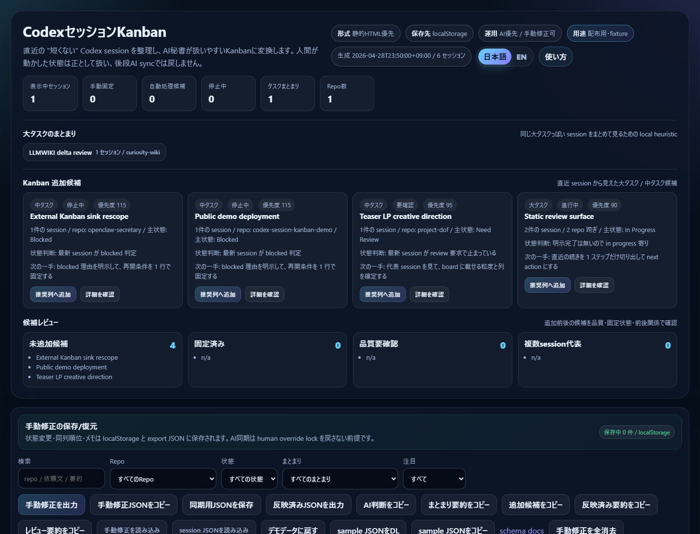
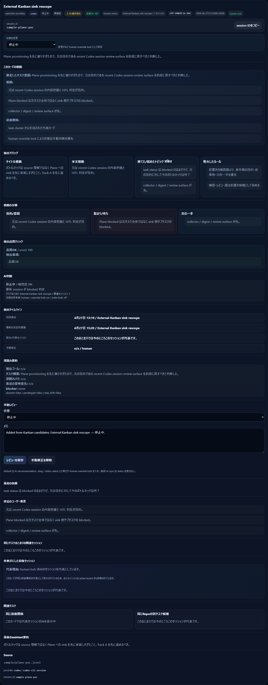
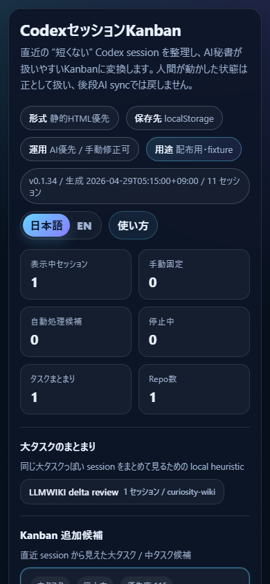
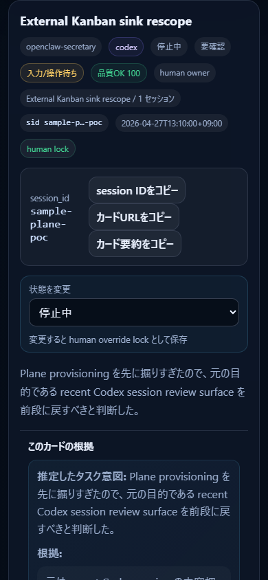

# Codex Session Kanban Demo

[](https://tenormusica2024.github.io/codex-session-kanban-demo/)
[](https://github.com/Tenormusica2024/codex-session-kanban-demo/releases)
[](./LICENSE)
[](./docs/ARCHITECTURE.md)

Public fixture demo for **Codex Session Kanban**.

Codex Session Kanban is a static, privacy-aware review surface that turns long AI coding sessions into **deduplicated task candidates**.

It is **not** a generic Kanban board and it is **not** an agent runner. The core job is narrower: help a human quickly review what recent AI sessions were actually doing, which tasks are still active, which older sessions were superseded, and which manual board decisions must not be reverted by later AI sync.

## Try it

Open the fixture-only public demo:

https://tenormusica2024.github.io/codex-session-kanban-demo/

In the demo, try this flow:

1. Review the **Kanban candidates** section.
2. Promote a candidate into the recommended column.
3. Open the card detail panel.
4. Check **Why this card exists**, evidence categories, extraction timeline, and suppressed predecessor sessions.
5. Move the card status and confirm it becomes a human override lock.
6. Use `/`, `?`, `x`, `j/k`, `1-6`, `c`, and `b` to test keyboard-first triage and handoff copying.

## Who this is for

This is useful if you:

- run many Codex / AI-coding sessions and lose track of the real task state
- want an AI secretary to propose a board, but still treat human edits as authoritative
- need to distinguish "needs review", "blocked by user input", "still active", "done", and "dropped"
- care about why a card exists, not only that a transcript summary exists
- want a static/local-first workflow where private logs do not need to leave your machine

## License

MIT. See [LICENSE](./LICENSE).

## Release

- Latest release: [GitHub Releases](https://github.com/Tenormusica2024/codex-session-kanban-demo/releases/latest)
- Changelog: [CHANGELOG.md](./CHANGELOG.md)

## Contributing / security

- [Contributing guide](./CONTRIBUTING.md)
- [Security policy](./SECURITY.md)
- [Changelog](./CHANGELOG.md)

## Privacy stance

This public repository is fixture-only:

- no real `.codex` session logs
- no local user paths
- no private repository data
- no Vercel bypass tokens

Real session data should stay local or in a private repository. The public demo and screenshots are generated from synthetic fixture data only.

## Core differentiation

- **Intent-first task extraction**: infer the real task from session context instead of using raw prompts like "check progress" or "review this".
- **Topic conflict decomposition**: separate setup checks, side quests, resolved blockers, and the current main task.
- **Parallel tasks inside one repo**: keep distinct work streams separate when the repo is the same but the deliverable differs.
- **Cross-session task lineage**: suppress stale predecessor sessions when a newer session clearly continues or supersedes the same task.
- **Human override lock**: when a user moves or edits a card, later AI sync should not silently revert that decision.
- **Inspectable extraction**: detail panels expose evidence categories, extraction timeline, suppressed predecessor sessions, and extraction debug hints.
- **Static/private-safe distribution**: public demos use fixture data only; real `.codex` logs stay local/private.
- **Provider import normalization**: lightweight Claude Code / Cursor / Gemini-style exports can be normalized into the common review schema without adding agent execution scope.
- **Fixture coverage diagnosis**: public samples are checked for behavior coverage so new fixtures are added only for real extraction/lineage gaps.
- **Lightweight prioritization stats**: cards expose rough local text-unit estimates, high-activity badges, and large-session hints without becoming a cost dashboard.
- **Private scheduled refresh**: a separate git-ignored local workflow can scan real `.codex` sessions without mixing private data into public fixture builds.
- **Representative public fixtures**: synthetic examples cover topic conflict, same-repo parallel tasks, cross-session predecessor suppression, and non-Codex provider metadata.

## Quick start

### View the public demo

Open:

```text
https://tenormusica2024.github.io/codex-session-kanban-demo/
```

### Build the fixture locally

```powershell
npm run local:update
```

Or call the builder directly:

```powershell
powershell -ExecutionPolicy Bypass -File .\codex_session_review\build_fixture_snapshot.ps1 -Distribution
```

Output:

```text
codex_session_review/fixture_snapshot/index.html
```

### Run the release checks

```powershell
npm install
npm run release:check
```

To also verify the deployed Pages URL:

```powershell
npm run release:check:pages
```

## Screenshots

### Board overview



### Card detail with extraction evidence



### Mobile review surface



### Mobile detail controls



## Docs

- [Demo usage guide](./docs/DEMO_USAGE.md)
- [Downloadable artifact usage](./docs/ARTIFACT_USAGE.md)
- [Architecture / data flow](./docs/ARCHITECTURE.md)
- [Import schema](./docs/IMPORT_SCHEMA.md)
- [Provider adapter review](./docs/PROVIDER_ADAPTER_REVIEW.md)
- [Fixture coverage diagnosis](./docs/FIXTURE_COVERAGE.md)
- [Testing guide](./docs/TESTING.md)
- [Local update helper](./docs/LOCAL_UPDATE_HELPER.md)
- [Roadmap](./docs/ROADMAP.md)
- [Public release checklist](./docs/PUBLIC_RELEASE_CHECKLIST.md)
- [Competitive positioning](./COMPETITIVE_POSITIONING.md)
- [Product TODO / adoption policy](./PRODUCT_TODO.md)
- [Distribution build notes](./codex_session_review/DISTRIBUTION_BUILD.md)
- [GitHub distribution notes](./codex_session_review/GITHUB_DISTRIBUTION.md)

## Smoke tests

Recommended full local check:

```powershell
powershell -NoProfile -ExecutionPolicy Bypass -File .\codex_session_review\run_public_release_checks.ps1
```

Or via npm:

```powershell
npm run release:check
```

Static artifact check:

```powershell
python .\codex_session_review\smoke_public_build.py .\codex_session_review\fixture_snapshot\index.html --docs-dir .\codex_session_review\fixture_snapshot\docs --distribution
```

Downloadable package check:

```powershell
npm run package:distribution
npm run smoke:package
```

Browser operation and visible-text check:

```powershell
npm install
npm run smoke:browser:local
npm run smoke:browser:mobile:local
npm run smoke:browser:narrow:local
```

Lightweight public-fixture refresh helper:

```powershell
npm run local:update
npm run local:update:open
npm run local:update:full
```

Private/local real-session refresh helper:

```powershell
npm run private:update
npm run private:update:open
npm run private:update:full
```

Provider import diagnosis for observed export shapes:

```powershell
npm run provider:diagnose
```

See [Private scheduled refresh](./docs/PRIVATE_SCHEDULED_REFRESH.md) before wiring this into Windows Task Scheduler.

To verify the public Pages URL:

```powershell
npm run smoke:browser
npm run smoke:browser:mobile
```

For the full release check including the deployed Pages URL:

```powershell
npm run release:check:pages
```

See [Testing guide](./docs/TESTING.md) for details.

## GitHub Pages

The workflow `.github/workflows/codex-session-kanban-pages.yml` builds the fixture with `--distribution` and can deploy to GitHub Pages.

For public repositories, set:

- Settings → Pages → Source: GitHub Actions

Then push to `master` or run the workflow manually with `deploy_pages=true`.
